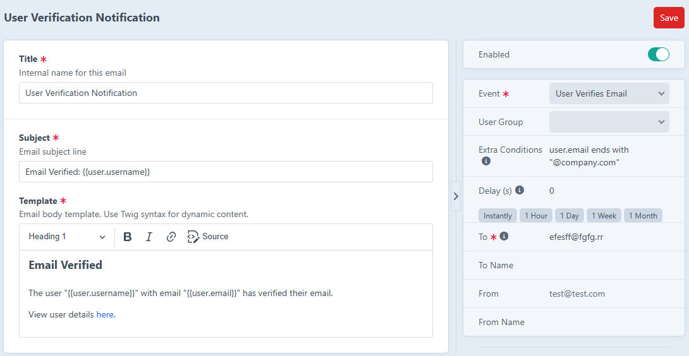

# MailCraft for Craft CMS

> **Client Friendly Email Notifications**

MailCraft allows content managers to set up email notifications directly from the Craft CMS control 
panel—no developer assistance required. Install once, and let your clients handle the rest.



## Key Features

- **Visual Email Builder**: Create beautiful email templates using familiar Twig syntax
- **Event-Driven Triggers**: Configure emails to send automatically based on specific system events
- **Scheduled Delivery**: Set up delayed emails for follow-ups, reminders, and nurture campaigns
- **Conditional Logic**: Target specific users or content with powerful filtering options
- **Zero Code Required**: All configuration happens in the admin interface

## Available Triggers

### Entry Events
- **Entry Created**: Send notifications when new content is published
- **Entry Updated**: Alert team members when existing content changes
- **Filtering Options**: Target by section, entry type, status, field values, and more

### User Events
- **User Created**: Welcome new registrations automatically
- **User Updated**: React to profile changes or important user updates
- **User Activated**: Send onboarding materials when accounts become active
- **Email Verified**: Acknowledge successful verification steps
- **Filtering Options**: Target by user group, custom fields, and more

### Missing an Event? ⚠️

If you need a specific event that isn't currently supported, please let us know! Give us a shout at 
[mailcraft.dev](https://mailcraft.dev) or open an issue on GitHub.

## 🔍 Example Use Cases

### Delayed Welcome Sequence
```
Trigger: User is Activated
Delay: 604800 seconds (7 days)
```

### Internal Review Notifications
```
Trigger: Entry Created
Extra Conditions: entry.section.handle == "newsArticles" and entry.approved != true
```

### Company Domain Registration Alerts
```
Trigger: User is Created
Extra Conditions: user.email ends with "@company.com"
```

## Coming Soon

- **Email Preview**: Test templates with sample data before activating
- **Craft Commerce Integration**: Order confirmation, abandoned cart reminders, and more

## Requirements

- Craft CMS 5.5.0 or later
- PHP 8.2 or later

## Feature Requests & Contributions

We're actively developing MailCraft and welcome community input:

- **Issues & Requests**: [Open an issue on GitHub](https://github.com/frontend-services/craft-mailcraft/issues)
- **Contact**: Reach out at [mailcraft.dev](https://mailcraft.dev)
- **Contribute**: Pull requests welcome for features that benefit the community